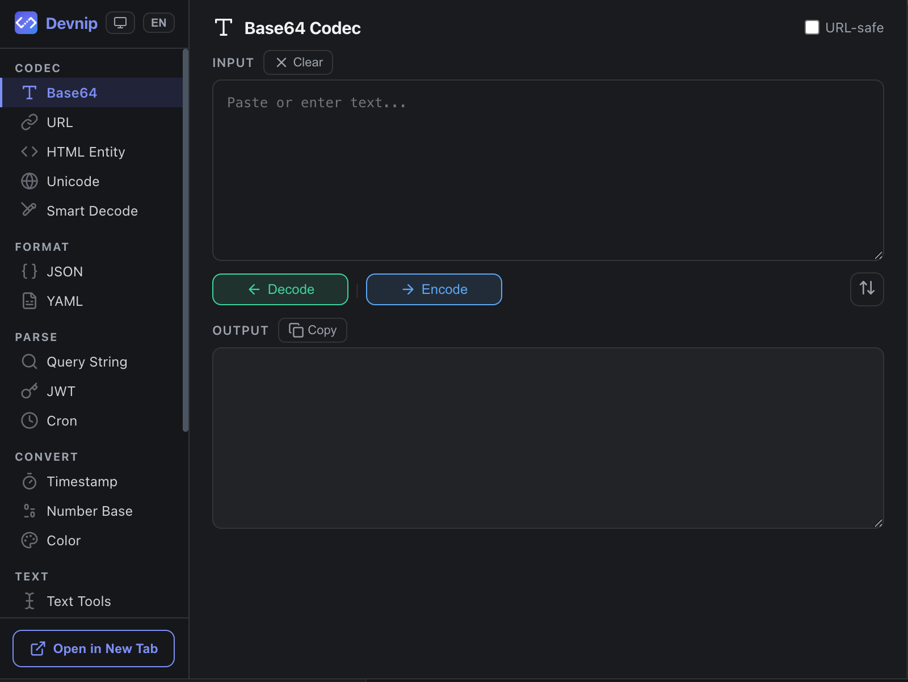

# Devnip

Chrome developer extension with 20+ codec, formatter, and conversion tools.




## 功能

| 分类 | 工具 |
|------|------|
| 编解码 | Base64、URL、HTML 实体、Unicode、智能解码 |
| 格式化 | JSON、YAML ↔ JSON |
| 解析 | Query String、JWT、Cron 表达式 |
| 转换 | 时间戳、进制、色值 |
| 文本 | 大小写/去重/排序/统计、Diff 对比、Markdown 预览 |
| 计算/生成 | Hash (MD5/SHA)、UUID/随机字符串 |
| 网络 | IP/CIDR 计算 |
| 正则 | 正则表达式测试 |

## 安装

### 从 GitHub Release 安装

1. 前往 [Releases](https://github.com/lonsty/devnip/releases) 下载最新的 `devnip-*.zip`
2. 解压到任意目录
3. 打开 Chrome，访问 `chrome://extensions/`
4. 开启右上角 **开发者模式**
5. 点击 **加载已解压的扩展程序**，选择解压后的目录

### 从源码安装

```bash
git clone https://github.com/lonsty/devnip.git
cd devnip
npm install
npm run build
```

然后按上述步骤 3-5 加载 `dist/` 目录即可。

## 使用方式

- **Popup 弹窗** — 点击浏览器右上角的 Devnip 图标，在侧边栏选择工具
- **右键菜单** — 在任意网页中选中文本，右键 → **Devnip** → 选择操作（结果自动复制到剪贴板）

## 本地开发

```bash
# 生成图标
node scripts/generate-icons.js

# 构建到 dist/
npm run build

# 构建并打包 zip
npm run zip
```

### 调试

- **Popup 页面**: 右键插件图标 → 审查弹出内容（或在 Popup 页面按 F12）
- **Service Worker**: `chrome://extensions/` → Devnip 卡片 → 点击「Service Worker」链接查看控制台
- **Console 调试**: Popup 页面的 DevTools Console 中可直接调用 `import()` 导入工具模块测试

## 项目结构

```
├── manifest.json          # 扩展清单 (Manifest V3)
├── popup/
│   ├── popup.html         # Popup 页面
│   ├── popup.css          # 样式
│   ├── popup.js           # 交互逻辑
│   ├── i18n.js            # 中英文国际化
│   └── icons.js           # SVG 图标定义
├── background/
│   └── service-worker.js  # 右键菜单注册与处理
├── utils/                 # 20 个工具模块
├── icons/                 # 图标 (16/48/128px)
├── scripts/
│   ├── build.js           # 构建脚本
│   └── generate-icons.js  # 图标生成脚本
├── .github/workflows/     # CI/CD
├── REQUIREMENTS.md        # 需求文档
└── CHANGELOG.md           # 变更日志
```

## 技术栈

- Manifest V3
- 纯原生 JavaScript (ES Modules)
- 零运行时依赖（MD5 和 YAML 解析器内置实现）
- Hash: Web Crypto API (`crypto.subtle.digest`)
- UUID: `crypto.randomUUID()` / `crypto.getRandomValues()`

## 隐私

- 不收集任何用户数据
- 不进行任何网络请求
- 所有计算均在本地完成

## 许可

MIT
