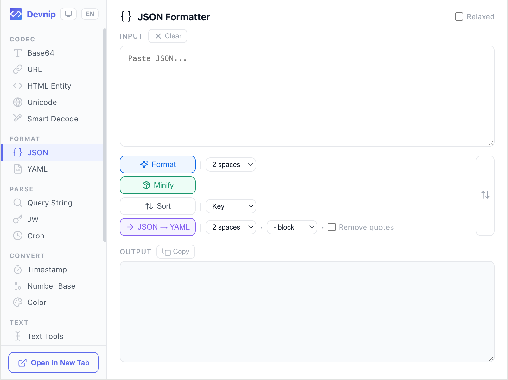
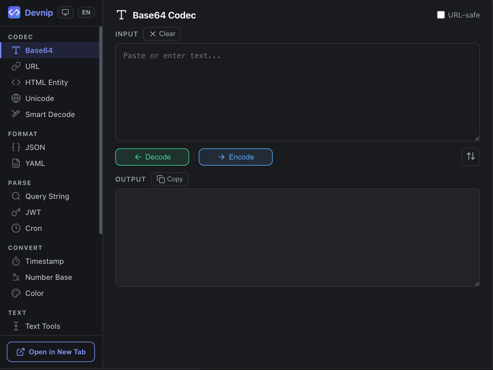

<p align="center">
  
</p>

<p align="center">
  <strong>Snip, transform, done.</strong><br>
  A Chrome extension with 20+ bite-sized dev tools for encoding, formatting, and conversion — right where you need them.
</p>

<p align="center">
  <a href="README.zh-CN.md">中文</a> | English
</p>

<p align="center">
  <a href="https://github.com/lonsty/devnip/releases"></a>
  <a href="LICENSE"></a>
  
  
</p>

<p align="center">
  
</p>

<p align="center">
  
</p>

## Features

| Category | Tools |
|----------|-------|
| Codec | Base64, URL, HTML Entity, Unicode, Smart Decode |
| Format | JSON, YAML ↔ JSON |
| Parse | Query String, JWT, Cron Expression |
| Convert | Timestamp, Number Base, Color |
| Text | Case / Dedup / Sort / Stats, Diff, Markdown Preview |
| Calc / Gen | Hash (MD5/SHA), UUID / Random String |
| Network | IP / CIDR Calculator |
| Regex | Regex Tester |

## Install

### From GitHub Release

1. Go to [Releases](https://github.com/lonsty/devnip/releases) and download the latest `devnip-*.zip`
2. Unzip to any directory
3. Open Chrome and navigate to `chrome://extensions/`
4. Enable **Developer mode** (top-right toggle)
5. Click **Load unpacked** and select the unzipped directory

### From Source

```bash
git clone https://github.com/lonsty/devnip.git
cd devnip
npm install
npm run build
```

Then follow steps 3–5 above, loading the `dist/` directory.

## Usage

- **Popup** — Click the Devnip icon in the browser toolbar, then select a tool from the sidebar
- **Context Menu** — Select text on any webpage, right-click → **Devnip** → choose an action (result auto-copied to clipboard)
- **Standalone Tab** — Click "Open in New Tab" at the bottom of the sidebar for a full-page layout

## Local Development

```bash
# Generate icons
node scripts/generate-icons.js

# Bundle popup.js (dev mode with watch)
npm run dev

# Build to dist/
npm run build

# Build and package zip
npm run zip
```

### Debugging

- **Popup**: Right-click the extension icon → Inspect popup (or press F12 in the popup)
- **Service Worker**: `chrome://extensions/` → Devnip card → click "Service Worker" link
- **Console**: In the popup DevTools console, use `import()` to test utility modules directly

## Project Structure

```
├── manifest.json          # Extension manifest (Manifest V3)
├── popup/
│   ├── popup.html         # Popup page
│   ├── popup.css          # Styles (GitHub Primer, light/dark theme)
│   ├── popup.js           # Entry point (tool init & event binding)
│   ├── popup.bundle.js    # esbuild bundle output
│   ├── constants.js       # Shared constants & config
│   ├── cache.js           # localStorage cache system
│   ├── theme.js           # Theme manager (system/light/dark cycle)
│   ├── render.js          # DOM helpers, Toast, clipboard, result box
│   ├── cm-editor.js       # CodeMirror 6 editor factory
│   ├── i18n.js            # EN/ZH internationalization
│   └── icons.js           # SVG icon definitions (GitHub Octicons)
├── background/
│   └── service-worker.js  # Context menu registration & handling
├── utils/                 # 20 tool modules
├── icons/                 # Icons (16/48/128px)
├── scripts/
│   ├── build.js           # Build + dist + zip script
│   ├── esbuild.js         # esbuild bundling config
│   └── generate-icons.js  # Icon generation script
├── CHANGELOG.md           # Changelog (EN)
├── CHANGELOG.zh-CN.md     # Changelog (ZH)
├── README.md              # This file (EN)
└── README.zh-CN.md        # Readme (ZH)
```

## Tech Stack

- Manifest V3
- Vanilla JavaScript (ES Modules)
- [CodeMirror 6](https://codemirror.net/6/) — Syntax-highlighted editor (JSON / YAML / Markdown / Cron / JWT / QueryString)
- [esbuild](https://esbuild.github.io/) — Zero-config bundler
- Zero runtime dependencies (CodeMirror bundled at build time; MD5 and YAML parser built-in)
- Hash: Web Crypto API (`crypto.subtle.digest`)
- UUID: `crypto.randomUUID()` / `crypto.getRandomValues()`

## Privacy

- No user data collection
- No network requests
- All computation runs locally

## Changelog

See [CHANGELOG.md](CHANGELOG.md) for a full list of changes.

## License

MIT
